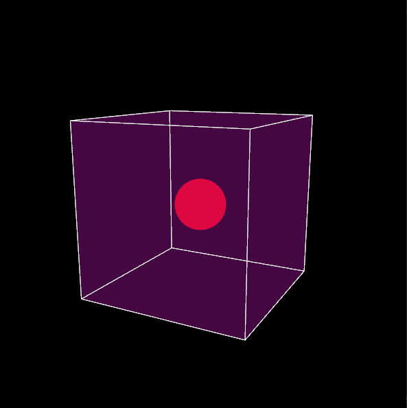

# Interactive 3D simulation with OpenGL

## Project Description
OpenGL program using GLM, GLEW and GLFW libraries featuring a transparent scene cube defining a scene, within which smaller moving geometric solids interact. Some of the tasks include window setup, dynamic appearance of elementary objects on spacebar press, user-controlled sphere movement, camera manipulation, and texture loading onto the sphere using the <t> key. Notable aspects include random object generation, proper collision physics, and visual cues for three-dimensional perception. The project focuses on interactive graphics, emphasizing collision dynamics and user-controlled elements.

  

This application was created for the course of Computer Graphics for the academic year 2020-21
